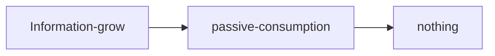

Name: management
Status: #MOC
Tags: [[time]] [[information]] [[zettelkasten]]

Description:

There are *two* things of absolute importance to manage:
- **time**, because we have too little of it(time management)
- **knowledge**, because we have too much of it(knowledge management)

To manage **time** we calendars, planners, schedules, time blocks, dashboards, todo lists.
To manage **knowledge** we have almost nothing. The majority of people don't have *systematic* way to take care of a lot of information growing around us. Instead they *passively* read books, watch lectures and occasional courses hoping that *somehow* information will magically stick or at least have *quick access* to useful information.

Even notes we take at college are not as useful as expected.

The solution is Zettelkasten.

#### References
https://www.youtube.com/watch?v=-r6fnC5lVfE&list=PL0BnBKZupLEkGTECVDBHkdcGndmBoDkcr&index=22&ab_channel=ArtemKirsanov
https://www.youtube.com/watch?v=MYJsGksojms&ab_channel=Peepnbrick