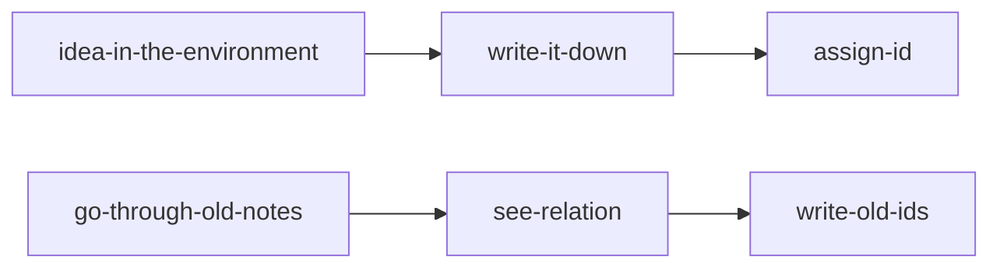

Name: zettelkasten
Status: #idea
Tags: [[how to use the obsidian app for notes]]

Description:

A note-taking system for knowledge [[management]] initiated in 20th century Germany by  [[Nicholas Lehmann]]. In other words, *systematic* approach for knowledge management.

How such a *system* works?
Why such a *system* works?
What are *principles* that underlie Zettelkasten?

Once we understand the *principles*, we can use them in our own workflows for knowledge management because Zettelkasten is not a perfect solution for knowledge management.

![[Pasted image 20220212180215.png]]

[[Nicholas Lehmann]] encountered an interesting [[idea]] or [[concept]] or [[information]]. Then he writes or collects ideas in a separate paper cards through thinking using his own words not copying it word by word. Each note or card has one idea in it. Then he assignes a unique id for each card. Notes are in 3x5 cards from giant boxes. Then he goes through old ones and asks himself to which of them this new idea relates. Then he writes ids to new note to which it has some relation.

#### References:
https://www.youtube.com/watch?v=-r6fnC5lVfE&list=PLgtmMKe4spCM5YQa3tbbdloBQB5RFKb3Y&index=3&ab_channel=ArtemKirsanov